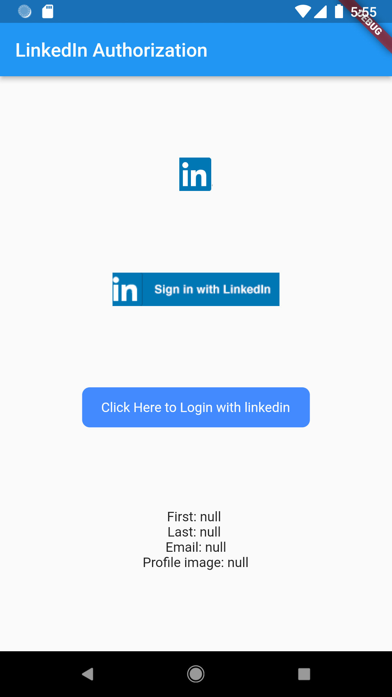

# easy_linkedin_login

## Important 
- It uses latest Linkedin Login product **Sign In with LinkedIn using OpenID Connect**
- Linkedin Product **Sign In with LinkedIn has been deprecated.**
- If you still want to use the deprecated product **Sign In with LinkedIn**, please refer to the [easy_linkedin_login version 1.0.3](https://pub.dev/packages/easy_linkedin_login/versions/1.0.3)

## Steps:
- Create App on the [LinkedIn Developer Console](https://www.linkedin.com/developers/apps/new) 
- Add product **Sign In with LinkedIn using OpenID Connect** in products tab
- Add **Authorized redirect URL** in Auth tab
- Get the `clientId`, `clientSecret` and `redirectUrl`.


## Getting started.
Create the `LinkedInConfig` that holds the keys.
```dart
  final config = LinkedInConfig(
    clientId: 'YOUR_CLIENT_ID',
    clientSecret: 'YOUR_CLIENT_SECRET',
    redirectUrl: 'YOUR_REDIRECT_URL',
  );
```

## Standard Widget
Standard LinkedIn button for login. This widget is modifiable.
```dart
  LinkedInStandardButton(
    config: config,
    destroySession: false,
    onError: (error) => log('Error: ${error.message}'),
    onGetAuthToken: (data) => log('Access token ${data.accessToken!}'),
    onGetUserProfile: (user) => log('User: ${user.name}'),
  ),
```
NOTE:
- You can use `mini` property to use `Small Linkedin Icon Button`

## Widget with custom widget
```dart
  LinkedInCustomButton(
    config: config,
    destroySession: false,
    onError: (error) => log('Error: ${error.message}'),
    onGetAuthToken: (data) => log('Access token ${data.accessToken!}'),
    onGetUserProfile: (user) => log('User: ${user.name}'),
    child: Text('Click Here to Login with linkedin'),
  ),
```

NOTE:
- `destroySession` clears the Linkedin login session if set to `true`

## Widget with customization
```dart
  LinkedInStandardButton(
    config: config,
    appbar: MyPreferredSizeWidget(),
    iconAssetPath: "/assets/my_custom_icon.png",
    iconWidth: 30,
    iconHeight: 30,
    destroySession: false,
    onError: (error) => log('Error: ${error.message}'),
    onGetAuthToken: (data) => log('Access token ${data.accessToken!}'),
    onGetUserProfile: (user) => log('User: ${user.name}'),
  ),

  LinkedInStandardButton(
    config: config,
    mini: true
    destroySession: false,
    onError: (error) => log('Error: ${error.message}'),
    onGetAuthToken: (data) => log('Access token ${data.accessToken!}'),
    onGetUserProfile: (user) => log('User: ${user.name}'),
  ),

  LinkedInCustomButton(
    config: config,
    appbar: MyPreferredSizeWidget(),
    destroySession: false,
    onError: (error) => log('Error: ${error.message}'),
    onGetAuthToken: (data) => log('Access token ${data.accessToken!}'),
    onGetUserProfile: (user) => log('User: ${user.name}'),
    child: Container(
      decoration: BoxDecoration(
        color: Colors.blueAccent,
        borderRadius: BorderRadius.circular(8),
      ),
      padding: EdgeInsets.symmetric(horizontal: 20, vertical: 13),
      child: Text(
        'Click Here to Login with linkedin',
        style: TextStyle(color: Colors.white),
       ),
    ),
  ),
```


## Screenshot
